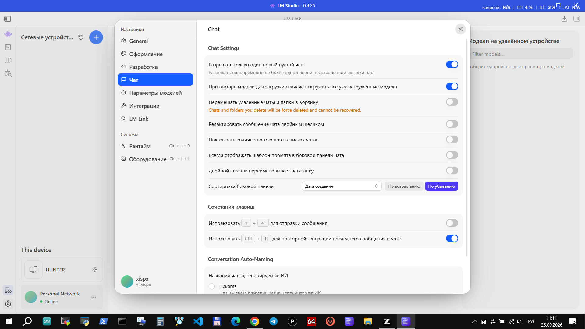
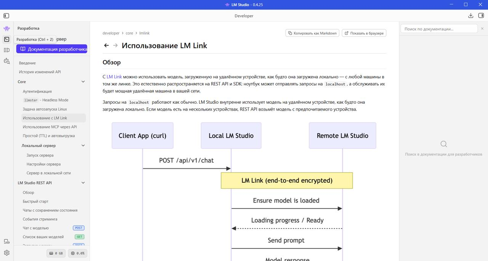

# LM Studio Russifier — русификатор LM Studio

**Русский | [English](README.en.md)**

[](https://github.com/xISPx/lm-studio-russifier/releases)
[](https://github.com/xISPx/lm-studio-russifier)
[](https://nodejs.org/)
[](LICENSE)
[](https://lmstudio.ai)

Неофициальный русификатор интерфейса [LM Studio](https://lmstudio.ai) (десктопное приложение для запуска локальных LLM). Приложение имеет встроенную локализацию на 39 языков, но русский помечен как «Beta» и заметно отстаёт: ~430 строк без перевода, устаревшие формулировки, а заметная часть интерфейса вообще захардкожена мимо системы локализации. Этот скрипт заменяет английские строки на русские прямо внутри `main_window.js`.

> **EN summary:** unofficial Russian UI translation for LM Studio on Windows. Patches `main_window.js` in place: 1441 dictionary strings (adds the missing `shared` namespace), ~1700 hardcoded UI strings and the full built-in Developer Docs (126 pages) translated. Requires Node.js 18+: `node run.js`. Rollback: `node run.js --restore`.





Что переведено:

- **словари i18next полностью**: 1441 строка (10 namespace'ов); добавлен отсутствовавший у русского языка namespace `shared` (186 строк), закрыты 430 дыр, вычитаны и исправлены смысловые ошибки официального «Beta»-перевода;
- **захардкоженные строки** (~1700): заголовки и табы настроек, панель чата, карточка модели, кнопки и всплывающие подсказки — всё то, что официальная локализация не переводит вовсе;
- **вся документация Developer Docs**: 126 страниц (~430 КБ) — руководство, REST API, MCP, `lms` CLI; код-блоки, команды и ссылки сохранены без изменений.

Намеренно **не** переводятся: названия API-эндпоинтов (Responses, Chat Completions), бренды (LM Studio, LM Link, Hub), названия языков в селекторе (они в родной локали) и скриншоты внутри документации.

> ⚠️ **Важно**
> - Русификатор модифицирует файлы приложения. Используйте на свой страх и риск.
> - **Автообновление LM Studio затирает русификацию.** После обновления запустите скрипт ещё раз.
> - Откат в любой момент: `node run.js --restore` (или переустановка LM Studio).
> - Проверено на **LM Studio 0.4.25 (Windows x64)**. На других версиях(module id и якоря другие) скрипт сообщит об ошибке и ничего не изменит.

---

## Требования

- Windows
- [Node.js](https://nodejs.org/) 18+ (`node -v`)
- Установленный LM Studio

## Установка русского языка

Скачайте репозиторий (кнопка **Code → Download ZIP**, распакуйте) или склонируйте:

```
git clone https://github.com/xISPx/lm-studio-russifier.git
cd lm-studio-russifier
```

Затем одна команда (двойной клик по `run.cmd` тоже работает):

```
node run.js
```

Скрипт сам найдёт LM Studio в `%LOCALAPPDATA%\Programs\LM Studio`, сделает резервную копию `main_window.js.orig.bak` и применит перевод. Перезапустите LM Studio — интерфейс, настройки и документация станут русскими.

Если язык интерфейса в настройках ещё не выбран: **Settings → General → Language → Русский (Beta)** (после русификации всё будет на русском, кроме самого названия пункта).

## Откат

```
node run.js --restore
```

восстанавливает оригинальный файл из резервной копии.

## Как это работает

Весь интерфейс LM Studio живёт в одном файле `resources\app\.webpack\renderer\main_window.js` (~35 МБ). Скрипт:

1. заменяет JSON-словари 9 namespace'ов локализации и добавляет недостающий `shared` как новый webpack-модуль;
2. заменяет захардкоженные строки по якорям `prop:"строка"` (замена только если все вхождения строки — отображаемые);
3. заменяет `content:'...'`-литералы страниц документации переводами (код-блоки не трогаются);
4. проверяет результат и пишет отчёт.

Повторный запуск безопасен: уже переведённые строки пропускаются.

## Структура репозитория

```
run.js            — скрипт русификации (точка входа)
run.cmd           — то же с двойным кликом
data/
  dicts.json            — словари 10 namespace'ов (1441 строка)
  hardcode_pairs.json   — пары «английская → русская» для хардкода
  hardcode_props.json   — проп-контексты каждой строки
  tail_rules.json       — точечные якорные замены
  special_docs.json     — две особые страницы документации
  docs/docs_texts.json  — 127 страниц документации
  docs/docs2_safe.json  — 8 страниц второго набора
patches/          — те же шаги по отдельности (для отладки)
screenshots/      — скриншоты
```

## Известные ограничения

- Названия эндпоинтов OpenAI/Anthropic API (Responses, Chat Completions, Messages) оставлены латиницей — это устоявшиеся имена методов.
- Скриншоты в документации английские (это картинки).
- Служебные строки, совпадающие с программными значениями, не трогаются (проверка «все вхождения — display-контексты»).

## Благодарности

Идея и структура репозитория вдохновлены [zcode-russifier](https://github.com/xISPx/zcode-russifier).
